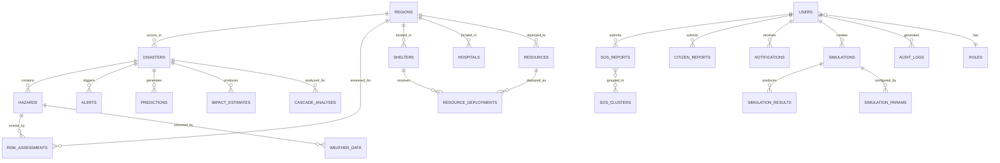

# ASPIRE — Backend Database Schema Document

> **AI-Powered Disaster Intelligence & Response Platform**
> **Tagline:** *From Warning to Action.*

**Version:** 1.0
**Last Updated:** October 2026
**Document Type:** Database Schema & Data Model Specification
**Database:** PostgreSQL 16 + PostGIS 3.4

---

## Table of Contents

1. [Schema Overview](#1-schema-overview)
2. [Entity-Relationship Diagram](#2-entity-relationship-diagram)
3. [Core Tables](#3-core-tables)
4. [Disaster & Hazard Tables](#4-disaster--hazard-tables)
5. [AI & Prediction Tables](#5-ai--prediction-tables)
6. [Resource & Infrastructure Tables](#6-resource--infrastructure-tables)
7. [Citizen Intelligence Tables](#7-citizen-intelligence-tables)
8. [Simulation Tables](#8-simulation-tables)
9. [System Tables](#9-system-tables)
10. [Indexes & Performance](#10-indexes--performance)
11. [Enums & Types](#11-enums--types)
12. [Seed Data Requirements](#12-seed-data-requirements)
13. [Migration Strategy](#13-migration-strategy)

---

## 1. Schema Overview

### Database Architecture

```
┌─────────────────────────────────────────────────────────────┐
│                    PostgreSQL 16 + PostGIS 3.4              │
│                                                             │
│   ┌─────────────┐  ┌──────────────┐  ┌─────────────────┐  │
│   │    CORE      │  │   DISASTER   │  │    AI / ML      │  │
│   │              │  │              │  │                 │  │
│   │  users       │  │  disasters   │  │  risk_assess.   │  │
│   │  roles       │  │  hazards     │  │  predictions    │  │
│   │  regions     │  │  alerts      │  │  impact_est.    │  │
│   │  audit_logs  │  │  weather_data│  │  cascade_anal.  │  │
│   └─────────────┘  └──────────────┘  └─────────────────┘  │
│                                                             │
│   ┌─────────────┐  ┌──────────────┐  ┌─────────────────┐  │
│   │  RESOURCE    │  │   CITIZEN    │  │   SIMULATION    │  │
│   │              │  │              │  │                 │  │
│   │  shelters    │  │  sos_reports │  │  simulations    │  │
│   │  hospitals   │  │  citizen_rpt │  │  sim_results    │  │
│   │  resources   │  │  sos_clusters│  │  sim_params     │  │
│   │  roads       │  │              │  │                 │  │
│   │  deployments │  │              │  │                 │  │
│   └─────────────┘  └──────────────┘  └─────────────────┘  │
│                                                             │
│   ┌────────────────────────────────────────────────────┐   │
│   │                SYSTEM                               │   │
│   │  notifications  │  data_sources  │  api_keys        │   │
│   └────────────────────────────────────────────────────┘   │
│                                                             │
└─────────────────────────────────────────────────────────────┘
```

### Table Count Summary

| Category | Tables | Description |
|---|---|---|
| Core | 4 | Users, roles, regions, audit |
| Disaster | 4 | Disasters, hazards, alerts, weather |
| AI/ML | 4 | Risk assessments, predictions, impact, cascades |
| Resources | 5 | Shelters, hospitals, resources, roads, deployments |
| Citizen | 3 | SOS reports, citizen reports, SOS clusters |
| Simulation | 3 | Simulations, results, parameters |
| System | 3 | Notifications, data sources, API keys |
| **Total** | **26** | |

---

## 2. Entity-Relationship Diagram



---

## 3. Core Tables

### 3.1 `users`

| Column | Type | Constraints | Description |
|---|---|---|---|
| `id` | `UUID` | PK, DEFAULT gen_random_uuid() | Unique user identifier |
| `email` | `VARCHAR(255)` | UNIQUE, NOT NULL | User email address |
| `phone` | `VARCHAR(20)` | UNIQUE, NULLABLE | Phone number |
| `password_hash` | `VARCHAR(255)` | NOT NULL | bcrypt hashed password |
| `full_name` | `VARCHAR(255)` | NOT NULL | Full name |
| `role_id` | `UUID` | FK → roles.id, NOT NULL | User role |
| `region_id` | `UUID` | FK → regions.id, NULLABLE | Assigned region (for authority) |
| `avatar_url` | `VARCHAR(500)` | NULLABLE | Profile picture URL |
| `is_active` | `BOOLEAN` | DEFAULT true | Account active status |
| `is_verified` | `BOOLEAN` | DEFAULT false | Email/phone verified |
| `last_login_at` | `TIMESTAMPTZ` | NULLABLE | Last login timestamp |
| `last_known_location` | `GEOMETRY(Point, 4326)` | NULLABLE | Last known GPS location |
| `notification_preferences` | `JSONB` | DEFAULT '{}' | Notification settings |
| `created_at` | `TIMESTAMPTZ` | DEFAULT NOW() | Account creation time |
| `updated_at` | `TIMESTAMPTZ` | DEFAULT NOW() | Last update time |

```sql
CREATE TABLE users (
    id UUID PRIMARY KEY DEFAULT gen_random_uuid(),
    email VARCHAR(255) UNIQUE NOT NULL,
    phone VARCHAR(20) UNIQUE,
    password_hash VARCHAR(255) NOT NULL,
    full_name VARCHAR(255) NOT NULL,
    role_id UUID NOT NULL REFERENCES roles(id),
    region_id UUID REFERENCES regions(id),
    avatar_url VARCHAR(500),
    is_active BOOLEAN DEFAULT true,
    is_verified BOOLEAN DEFAULT false,
    last_login_at TIMESTAMPTZ,
    last_known_location GEOMETRY(Point, 4326),
    notification_preferences JSONB DEFAULT '{}',
    created_at TIMESTAMPTZ DEFAULT NOW(),
    updated_at TIMESTAMPTZ DEFAULT NOW()
);

CREATE INDEX idx_users_email ON users(email);
CREATE INDEX idx_users_role ON users(role_id);
CREATE INDEX idx_users_region ON users(region_id);
CREATE INDEX idx_users_location ON users USING GIST(last_known_location);
```

---

### 3.2 `roles`

| Column | Type | Constraints | Description |
|---|---|---|---|
| `id` | `UUID` | PK | Unique role identifier |
| `name` | `VARCHAR(50)` | UNIQUE, NOT NULL | Role name |
| `display_name` | `VARCHAR(100)` | NOT NULL | Human-readable name |
| `permissions` | `JSONB` | NOT NULL | Permission array |
| `description` | `TEXT` | NULLABLE | Role description |
| `created_at` | `TIMESTAMPTZ` | DEFAULT NOW() | Creation time |

```sql
CREATE TABLE roles (
    id UUID PRIMARY KEY DEFAULT gen_random_uuid(),
    name VARCHAR(50) UNIQUE NOT NULL,
    display_name VARCHAR(100) NOT NULL,
    permissions JSONB NOT NULL DEFAULT '[]',
    description TEXT,
    created_at TIMESTAMPTZ DEFAULT NOW()
);

-- Seed default roles
INSERT INTO roles (name, display_name, permissions) VALUES
    ('citizen', 'Citizen', '["read:risk", "write:sos", "read:shelters", "read:alerts"]'),
    ('authority', 'Authority', '["read:risk", "write:resources", "manage:sos", "read:analytics", "write:simulation", "manage:alerts"]'),
    ('admin', 'Administrator', '["*"]'),
    ('super_admin', 'Super Administrator', '["*"]');
```

---

### 3.3 `regions`

| Column | Type | Constraints | Description |
|---|---|---|---|
| `id` | `UUID` | PK | Unique region identifier |
| `name` | `VARCHAR(255)` | NOT NULL | Region name |
| `type` | `region_type_enum` | NOT NULL | state/district/city/ward/zone |
| `code` | `VARCHAR(50)` | UNIQUE | Region code (e.g., "OD-KJR") |
| `parent_id` | `UUID` | FK → regions.id, NULLABLE | Parent region |
| `geometry` | `GEOMETRY(MultiPolygon, 4326)` | NOT NULL | Region boundary |
| `centroid` | `GEOMETRY(Point, 4326)` | GENERATED | Auto-calculated centroid |
| `area_sq_km` | `DECIMAL(12,4)` | NULLABLE | Area in square km |
| `population` | `INTEGER` | NULLABLE | Estimated population |
| `population_density` | `DECIMAL(10,2)` | NULLABLE | People per sq km |
| `elevation_avg_m` | `DECIMAL(8,2)` | NULLABLE | Average elevation in meters |
| `metadata` | `JSONB` | DEFAULT '{}' | Additional properties |
| `created_at` | `TIMESTAMPTZ` | DEFAULT NOW() | Creation time |
| `updated_at` | `TIMESTAMPTZ` | DEFAULT NOW() | Last update |

```sql
CREATE TABLE regions (
    id UUID PRIMARY KEY DEFAULT gen_random_uuid(),
    name VARCHAR(255) NOT NULL,
    type region_type_enum NOT NULL,
    code VARCHAR(50) UNIQUE,
    parent_id UUID REFERENCES regions(id),
    geometry GEOMETRY(MultiPolygon, 4326) NOT NULL,
    centroid GEOMETRY(Point, 4326) GENERATED ALWAYS AS (ST_Centroid(geometry)) STORED,
    area_sq_km DECIMAL(12,4),
    population INTEGER,
    population_density DECIMAL(10,2),
    elevation_avg_m DECIMAL(8,2),
    metadata JSONB DEFAULT '{}',
    created_at TIMESTAMPTZ DEFAULT NOW(),
    updated_at TIMESTAMPTZ DEFAULT NOW()
);

CREATE INDEX idx_regions_geometry ON regions USING GIST(geometry);
CREATE INDEX idx_regions_parent ON regions(parent_id);
CREATE INDEX idx_regions_type ON regions(type);
```

---

### 3.4 `audit_logs`

| Column | Type | Constraints | Description |
|---|---|---|---|
| `id` | `UUID` | PK | Log entry ID |
| `user_id` | `UUID` | FK → users.id, NOT NULL | Acting user |
| `action` | `VARCHAR(100)` | NOT NULL | Action performed |
| `entity_type` | `VARCHAR(100)` | NOT NULL | Entity type affected |
| `entity_id` | `UUID` | NULLABLE | Entity ID affected |
| `old_values` | `JSONB` | NULLABLE | Previous state |
| `new_values` | `JSONB` | NULLABLE | New state |
| `ip_address` | `INET` | NULLABLE | Client IP |
| `user_agent` | `TEXT` | NULLABLE | Client user agent |
| `created_at` | `TIMESTAMPTZ` | DEFAULT NOW() | Log timestamp |

```sql
CREATE TABLE audit_logs (
    id UUID PRIMARY KEY DEFAULT gen_random_uuid(),
    user_id UUID NOT NULL REFERENCES users(id),
    action VARCHAR(100) NOT NULL,
    entity_type VARCHAR(100) NOT NULL,
    entity_id UUID,
    old_values JSONB,
    new_values JSONB,
    ip_address INET,
    user_agent TEXT,
    created_at TIMESTAMPTZ DEFAULT NOW()
);

CREATE INDEX idx_audit_user ON audit_logs(user_id);
CREATE INDEX idx_audit_entity ON audit_logs(entity_type, entity_id);
CREATE INDEX idx_audit_created ON audit_logs(created_at DESC);
```

---

## 4. Disaster & Hazard Tables

### 4.1 `disasters`

| Column | Type | Constraints | Description |
|---|---|---|---|
| `id` | `UUID` | PK | Disaster event ID |
| `name` | `VARCHAR(255)` | NOT NULL | Disaster name/title |
| `type` | `hazard_type_enum` | NOT NULL | Disaster type |
| `severity` | `severity_enum` | NOT NULL | Overall severity |
| `status` | `disaster_status_enum` | NOT NULL | monitoring/active/resolving/resolved |
| `region_id` | `UUID` | FK → regions.id | Primary affected region |
| `geometry` | `GEOMETRY(MultiPolygon, 4326)` | NULLABLE | Affected area boundary |
| `center_point` | `GEOMETRY(Point, 4326)` | NULLABLE | Disaster epicenter |
| `start_time` | `TIMESTAMPTZ` | NOT NULL | Event start time |
| `end_time` | `TIMESTAMPTZ` | NULLABLE | Event end time |
| `peak_severity` | `severity_enum` | NULLABLE | Maximum severity reached |
| `peak_time` | `TIMESTAMPTZ` | NULLABLE | Time of peak severity |
| `description` | `TEXT` | NULLABLE | Event description |
| `source` | `VARCHAR(100)` | NULLABLE | Data source (weather API, manual, etc.) |
| `estimated_affected_population` | `INTEGER` | NULLABLE | Estimated affected people |
| `estimated_damage_score` | `DECIMAL(5,3)` | NULLABLE | 0-1 damage score |
| `metadata` | `JSONB` | DEFAULT '{}' | Additional properties |
| `created_by` | `UUID` | FK → users.id, NULLABLE | User who created (manual entry) |
| `created_at` | `TIMESTAMPTZ` | DEFAULT NOW() | Record creation |
| `updated_at` | `TIMESTAMPTZ` | DEFAULT NOW() | Last update |

```sql
CREATE TABLE disasters (
    id UUID PRIMARY KEY DEFAULT gen_random_uuid(),
    name VARCHAR(255) NOT NULL,
    type hazard_type_enum NOT NULL,
    severity severity_enum NOT NULL DEFAULT 'low',
    status disaster_status_enum NOT NULL DEFAULT 'monitoring',
    region_id UUID REFERENCES regions(id),
    geometry GEOMETRY(MultiPolygon, 4326),
    center_point GEOMETRY(Point, 4326),
    start_time TIMESTAMPTZ NOT NULL,
    end_time TIMESTAMPTZ,
    peak_severity severity_enum,
    peak_time TIMESTAMPTZ,
    description TEXT,
    source VARCHAR(100),
    estimated_affected_population INTEGER,
    estimated_damage_score DECIMAL(5,3),
    metadata JSONB DEFAULT '{}',
    created_by UUID REFERENCES users(id),
    created_at TIMESTAMPTZ DEFAULT NOW(),
    updated_at TIMESTAMPTZ DEFAULT NOW()
);

CREATE INDEX idx_disasters_type ON disasters(type);
CREATE INDEX idx_disasters_status ON disasters(status);
CREATE INDEX idx_disasters_region ON disasters(region_id);
CREATE INDEX idx_disasters_geometry ON disasters USING GIST(geometry);
CREATE INDEX idx_disasters_time ON disasters(start_time DESC);
CREATE INDEX idx_disasters_active ON disasters(status) WHERE status IN ('monitoring', 'active');
```

---

### 4.2 `hazards`

| Column | Type | Constraints | Description |
|---|---|---|---|
| `id` | `UUID` | PK | Hazard data point ID |
| `disaster_id` | `UUID` | FK → disasters.id, NULLABLE | Associated disaster |
| `type` | `hazard_type_enum` | NOT NULL | Hazard type |
| `severity` | `severity_enum` | NOT NULL | Severity level |
| `score` | `DECIMAL(5,4)` | NOT NULL | 0-1 hazard score |
| `location` | `GEOMETRY(Point, 4326)` | NOT NULL | Hazard location |
| `affected_area` | `GEOMETRY(MultiPolygon, 4326)` | NULLABLE | Affected area polygon |
| `radius_km` | `DECIMAL(8,3)` | NULLABLE | Estimated impact radius |
| `parameters` | `JSONB` | NOT NULL | Hazard-specific parameters |
| `data_source` | `VARCHAR(100)` | NOT NULL | Where data came from |
| `observed_at` | `TIMESTAMPTZ` | NOT NULL | When data was observed |
| `valid_until` | `TIMESTAMPTZ` | NULLABLE | Data validity expiry |
| `confidence` | `DECIMAL(5,4)` | NULLABLE | Data confidence 0-1 |
| `created_at` | `TIMESTAMPTZ` | DEFAULT NOW() | Record creation |

**Hazard-specific `parameters` JSONB examples:**

```json
// Flood
{
  "rainfall_mm_hr": 85.5,
  "river_level_m": 6.2,
  "river_level_threshold_m": 5.0,
  "soil_saturation_pct": 92,
  "drainage_capacity_pct": 65,
  "water_depth_estimated_m": 1.5
}

// Cyclone
{
  "wind_speed_kmh": 180,
  "category": 3,
  "central_pressure_hpa": 960,
  "movement_direction_deg": 315,
  "movement_speed_kmh": 18,
  "predicted_track": [[85.5, 20.2], [85.0, 21.0], [84.5, 21.8]]
}

// Heatwave
{
  "temperature_c": 47.5,
  "feels_like_c": 52.0,
  "humidity_pct": 25,
  "duration_hours": 72,
  "wet_bulb_temperature_c": 35
}

// Earthquake
{
  "magnitude": 5.8,
  "depth_km": 10,
  "mmi_intensity": "VI"
}

// Landslide
{
  "slope_angle_deg": 35,
  "soil_type": "clay",
  "vegetation_cover_pct": 15,
  "antecedent_rainfall_mm": 250
}
```

```sql
CREATE TABLE hazards (
    id UUID PRIMARY KEY DEFAULT gen_random_uuid(),
    disaster_id UUID REFERENCES disasters(id) ON DELETE SET NULL,
    type hazard_type_enum NOT NULL,
    severity severity_enum NOT NULL,
    score DECIMAL(5,4) NOT NULL CHECK (score >= 0 AND score <= 1),
    location GEOMETRY(Point, 4326) NOT NULL,
    affected_area GEOMETRY(MultiPolygon, 4326),
    radius_km DECIMAL(8,3),
    parameters JSONB NOT NULL DEFAULT '{}',
    data_source VARCHAR(100) NOT NULL,
    observed_at TIMESTAMPTZ NOT NULL,
    valid_until TIMESTAMPTZ,
    confidence DECIMAL(5,4) CHECK (confidence >= 0 AND confidence <= 1),
    created_at TIMESTAMPTZ DEFAULT NOW()
);

CREATE INDEX idx_hazards_type ON hazards(type);
CREATE INDEX idx_hazards_location ON hazards USING GIST(location);
CREATE INDEX idx_hazards_area ON hazards USING GIST(affected_area);
CREATE INDEX idx_hazards_disaster ON hazards(disaster_id);
CREATE INDEX idx_hazards_observed ON hazards(observed_at DESC);
CREATE INDEX idx_hazards_severity ON hazards(severity);
```

---

### 4.3 `alerts`

| Column | Type | Constraints | Description |
|---|---|---|---|
| `id` | `UUID` | PK | Alert ID |
| `disaster_id` | `UUID` | FK → disasters.id, NULLABLE | Associated disaster |
| `type` | `alert_type_enum` | NOT NULL | Alert category |
| `severity` | `severity_enum` | NOT NULL | Alert severity |
| `title` | `VARCHAR(255)` | NOT NULL | Alert title |
| `message` | `TEXT` | NOT NULL | Alert message content |
| `target_audience` | `alert_audience_enum` | NOT NULL | authority/citizen/all |
| `target_region_id` | `UUID` | FK → regions.id, NULLABLE | Target region |
| `target_area` | `GEOMETRY(MultiPolygon, 4326)` | NULLABLE | Target area |
| `status` | `alert_status_enum` | NOT NULL | active/acknowledged/resolved/expired |
| `auto_generated` | `BOOLEAN` | DEFAULT true | AI or manual? |
| `acknowledged_by` | `UUID` | FK → users.id, NULLABLE | Who acknowledged |
| `acknowledged_at` | `TIMESTAMPTZ` | NULLABLE | When acknowledged |
| `expires_at` | `TIMESTAMPTZ` | NULLABLE | Auto-expiry time |
| `metadata` | `JSONB` | DEFAULT '{}' | Additional data |
| `created_at` | `TIMESTAMPTZ` | DEFAULT NOW() | Alert creation |

```sql
CREATE TABLE alerts (
    id UUID PRIMARY KEY DEFAULT gen_random_uuid(),
    disaster_id UUID REFERENCES disasters(id) ON DELETE SET NULL,
    type alert_type_enum NOT NULL,
    severity severity_enum NOT NULL,
    title VARCHAR(255) NOT NULL,
    message TEXT NOT NULL,
    target_audience alert_audience_enum NOT NULL DEFAULT 'all',
    target_region_id UUID REFERENCES regions(id),
    target_area GEOMETRY(MultiPolygon, 4326),
    status alert_status_enum NOT NULL DEFAULT 'active',
    auto_generated BOOLEAN DEFAULT true,
    acknowledged_by UUID REFERENCES users(id),
    acknowledged_at TIMESTAMPTZ,
    expires_at TIMESTAMPTZ,
    metadata JSONB DEFAULT '{}',
    created_at TIMESTAMPTZ DEFAULT NOW()
);

CREATE INDEX idx_alerts_status ON alerts(status);
CREATE INDEX idx_alerts_severity ON alerts(severity);
CREATE INDEX idx_alerts_region ON alerts(target_region_id);
CREATE INDEX idx_alerts_active ON alerts(status, severity) WHERE status = 'active';
CREATE INDEX idx_alerts_created ON alerts(created_at DESC);
```

---

### 4.4 `weather_data`

| Column | Type | Constraints | Description |
|---|---|---|---|
| `id` | `UUID` | PK | Weather data point ID |
| `location` | `GEOMETRY(Point, 4326)` | NOT NULL | Observation location |
| `region_id` | `UUID` | FK → regions.id, NULLABLE | Associated region |
| `temperature_c` | `DECIMAL(5,2)` | NULLABLE | Temperature (°C) |
| `feels_like_c` | `DECIMAL(5,2)` | NULLABLE | Feels-like temperature |
| `humidity_pct` | `DECIMAL(5,2)` | NULLABLE | Humidity percentage |
| `pressure_hpa` | `DECIMAL(7,2)` | NULLABLE | Atmospheric pressure |
| `wind_speed_kmh` | `DECIMAL(6,2)` | NULLABLE | Wind speed |
| `wind_direction_deg` | `DECIMAL(5,2)` | NULLABLE | Wind direction |
| `rainfall_mm` | `DECIMAL(8,2)` | NULLABLE | Rainfall (mm) |
| `rainfall_rate_mm_hr` | `DECIMAL(8,2)` | NULLABLE | Rainfall rate |
| `visibility_km` | `DECIMAL(6,2)` | NULLABLE | Visibility |
| `cloud_cover_pct` | `DECIMAL(5,2)` | NULLABLE | Cloud cover |
| `uv_index` | `DECIMAL(4,1)` | NULLABLE | UV index |
| `weather_condition` | `VARCHAR(100)` | NULLABLE | Condition description |
| `data_source` | `VARCHAR(100)` | NOT NULL | API source |
| `observed_at` | `TIMESTAMPTZ` | NOT NULL | Observation time |
| `forecast_for` | `TIMESTAMPTZ` | NULLABLE | Forecast target time (null for current) |
| `created_at` | `TIMESTAMPTZ` | DEFAULT NOW() | Record creation |

```sql
CREATE TABLE weather_data (
    id UUID PRIMARY KEY DEFAULT gen_random_uuid(),
    location GEOMETRY(Point, 4326) NOT NULL,
    region_id UUID REFERENCES regions(id),
    temperature_c DECIMAL(5,2),
    feels_like_c DECIMAL(5,2),
    humidity_pct DECIMAL(5,2),
    pressure_hpa DECIMAL(7,2),
    wind_speed_kmh DECIMAL(6,2),
    wind_direction_deg DECIMAL(5,2),
    rainfall_mm DECIMAL(8,2),
    rainfall_rate_mm_hr DECIMAL(8,2),
    visibility_km DECIMAL(6,2),
    cloud_cover_pct DECIMAL(5,2),
    uv_index DECIMAL(4,1),
    weather_condition VARCHAR(100),
    data_source VARCHAR(100) NOT NULL,
    observed_at TIMESTAMPTZ NOT NULL,
    forecast_for TIMESTAMPTZ,
    created_at TIMESTAMPTZ DEFAULT NOW()
);

CREATE INDEX idx_weather_location ON weather_data USING GIST(location);
CREATE INDEX idx_weather_region ON weather_data(region_id);
CREATE INDEX idx_weather_observed ON weather_data(observed_at DESC);
CREATE INDEX idx_weather_source ON weather_data(data_source);

-- Partition by month for performance (large table)
-- Consider: CREATE TABLE weather_data (...) PARTITION BY RANGE (observed_at);
```

---

## 5. AI & Prediction Tables

### 5.1 `risk_assessments`

| Column | Type | Constraints | Description |
|---|---|---|---|
| `id` | `UUID` | PK | Assessment ID |
| `region_id` | `UUID` | FK → regions.id, NOT NULL | Assessed region |
| `hazard_type` | `hazard_type_enum` | NOT NULL | Hazard type assessed |
| `risk_level` | `severity_enum` | NOT NULL | Overall risk level |
| `risk_score` | `DECIMAL(5,4)` | NOT NULL | 0-1 risk score |
| `confidence` | `DECIMAL(5,4)` | NOT NULL | Model confidence 0-1 |
| `contributing_factors` | `JSONB` | NOT NULL | Factor breakdown |
| `model_version` | `VARCHAR(50)` | NOT NULL | ML model version |
| `model_name` | `VARCHAR(100)` | NOT NULL | ML model name |
| `explanation` | `TEXT` | NULLABLE | Human-readable explanation |
| `recommended_actions` | `JSONB` | DEFAULT '[]' | Recommended actions array |
| `previous_score` | `DECIMAL(5,4)` | NULLABLE | Previous assessment score |
| `score_trend` | `VARCHAR(20)` | NULLABLE | increasing/decreasing/stable |
| `valid_from` | `TIMESTAMPTZ` | NOT NULL | Assessment start validity |
| `valid_until` | `TIMESTAMPTZ` | NOT NULL | Assessment end validity |
| `disaster_id` | `UUID` | FK → disasters.id, NULLABLE | Associated disaster |
| `created_at` | `TIMESTAMPTZ` | DEFAULT NOW() | Record creation |

**`contributing_factors` JSONB structure:**

```json
[
  {
    "factor": "rainfall_intensity",
    "value": "very_high",
    "numeric_value": 85.5,
    "unit": "mm/hr",
    "weight": 0.30,
    "contribution_score": 0.27,
    "description": "Extreme rainfall exceeding 80mm/hr threshold"
  },
  {
    "factor": "river_level",
    "value": "rising",
    "numeric_value": 6.2,
    "unit": "meters",
    "weight": 0.25,
    "contribution_score": 0.22,
    "description": "River level 1.2m above danger mark"
  },
  {
    "factor": "elevation",
    "value": "low",
    "numeric_value": 5.0,
    "unit": "meters_asl",
    "weight": 0.20,
    "contribution_score": 0.18,
    "description": "Low-lying area susceptible to inundation"
  },
  {
    "factor": "historical_frequency",
    "value": "high",
    "numeric_value": 12,
    "unit": "events_per_decade",
    "weight": 0.15,
    "contribution_score": 0.12,
    "description": "High historical flood frequency"
  },
  {
    "factor": "population_exposure",
    "value": "high",
    "numeric_value": 42000,
    "unit": "people",
    "weight": 0.10,
    "contribution_score": 0.08,
    "description": "Dense population in flood-prone zone"
  }
]
```

```sql
CREATE TABLE risk_assessments (
    id UUID PRIMARY KEY DEFAULT gen_random_uuid(),
    region_id UUID NOT NULL REFERENCES regions(id),
    hazard_type hazard_type_enum NOT NULL,
    risk_level severity_enum NOT NULL,
    risk_score DECIMAL(5,4) NOT NULL CHECK (risk_score >= 0 AND risk_score <= 1),
    confidence DECIMAL(5,4) NOT NULL CHECK (confidence >= 0 AND confidence <= 1),
    contributing_factors JSONB NOT NULL DEFAULT '[]',
    model_version VARCHAR(50) NOT NULL,
    model_name VARCHAR(100) NOT NULL,
    explanation TEXT,
    recommended_actions JSONB DEFAULT '[]',
    previous_score DECIMAL(5,4),
    score_trend VARCHAR(20),
    valid_from TIMESTAMPTZ NOT NULL,
    valid_until TIMESTAMPTZ NOT NULL,
    disaster_id UUID REFERENCES disasters(id),
    created_at TIMESTAMPTZ DEFAULT NOW()
);

CREATE INDEX idx_risk_region ON risk_assessments(region_id);
CREATE INDEX idx_risk_hazard ON risk_assessments(hazard_type);
CREATE INDEX idx_risk_level ON risk_assessments(risk_level);
CREATE INDEX idx_risk_validity ON risk_assessments(valid_from, valid_until);
CREATE INDEX idx_risk_latest ON risk_assessments(region_id, hazard_type, created_at DESC);
```

---

### 5.2 `predictions`

| Column | Type | Constraints | Description |
|---|---|---|---|
| `id` | `UUID` | PK | Prediction ID |
| `disaster_id` | `UUID` | FK → disasters.id, NULLABLE | Associated disaster |
| `region_id` | `UUID` | FK → regions.id, NOT NULL | Predicted region |
| `hazard_type` | `hazard_type_enum` | NOT NULL | Hazard type |
| `prediction_type` | `prediction_type_enum` | NOT NULL | flood_extent/wind_path/temperature/etc |
| `predicted_value` | `DECIMAL(10,4)` | NULLABLE | Numeric predicted value |
| `predicted_category` | `VARCHAR(50)` | NULLABLE | Categorical prediction |
| `predicted_geometry` | `GEOMETRY(MultiPolygon, 4326)` | NULLABLE | Predicted spatial extent |
| `confidence` | `DECIMAL(5,4)` | NOT NULL | Prediction confidence |
| `forecast_horizon_hours` | `INTEGER` | NOT NULL | Hours ahead predicted |
| `forecast_time` | `TIMESTAMPTZ` | NOT NULL | Predicted target time |
| `model_name` | `VARCHAR(100)` | NOT NULL | Model used |
| `model_version` | `VARCHAR(50)` | NOT NULL | Model version |
| `input_features` | `JSONB` | DEFAULT '{}' | Input data summary |
| `created_at` | `TIMESTAMPTZ` | DEFAULT NOW() | When prediction was made |

```sql
CREATE TABLE predictions (
    id UUID PRIMARY KEY DEFAULT gen_random_uuid(),
    disaster_id UUID REFERENCES disasters(id),
    region_id UUID NOT NULL REFERENCES regions(id),
    hazard_type hazard_type_enum NOT NULL,
    prediction_type prediction_type_enum NOT NULL,
    predicted_value DECIMAL(10,4),
    predicted_category VARCHAR(50),
    predicted_geometry GEOMETRY(MultiPolygon, 4326),
    confidence DECIMAL(5,4) NOT NULL CHECK (confidence >= 0 AND confidence <= 1),
    forecast_horizon_hours INTEGER NOT NULL,
    forecast_time TIMESTAMPTZ NOT NULL,
    model_name VARCHAR(100) NOT NULL,
    model_version VARCHAR(50) NOT NULL,
    input_features JSONB DEFAULT '{}',
    created_at TIMESTAMPTZ DEFAULT NOW()
);

CREATE INDEX idx_predictions_region ON predictions(region_id);
CREATE INDEX idx_predictions_hazard ON predictions(hazard_type);
CREATE INDEX idx_predictions_forecast ON predictions(forecast_time);
CREATE INDEX idx_predictions_geometry ON predictions USING GIST(predicted_geometry);
```

---

### 5.3 `impact_estimates`

| Column | Type | Constraints | Description |
|---|---|---|---|
| `id` | `UUID` | PK | Impact estimate ID |
| `disaster_id` | `UUID` | FK → disasters.id | Associated disaster |
| `region_id` | `UUID` | FK → regions.id | Region assessed |
| `population_affected` | `INTEGER` | NULLABLE | Estimated people affected |
| `buildings_at_risk` | `INTEGER` | NULLABLE | Buildings exposed |
| `roads_at_risk` | `INTEGER` | NULLABLE | Roads potentially blocked |
| `hospitals_at_risk` | `INTEGER` | NULLABLE | Hospitals with access risk |
| `shelters_at_pressure` | `INTEGER` | NULLABLE | Shelters nearing capacity |
| `estimated_rescue_demand` | `INTEGER` | NULLABLE | Rescue operations needed |
| `estimated_medical_demand` | `INTEGER` | NULLABLE | Medical cases expected |
| `estimated_food_demand_kg` | `DECIMAL(10,2)` | NULLABLE | Food demand (kg) |
| `estimated_water_demand_l` | `DECIMAL(10,2)` | NULLABLE | Water demand (liters) |
| `economic_damage_estimate` | `DECIMAL(15,2)` | NULLABLE | Damage in currency |
| `impact_severity` | `severity_enum` | NOT NULL | Overall impact severity |
| `impact_score` | `DECIMAL(5,4)` | NOT NULL | 0-1 impact score |
| `confidence` | `DECIMAL(5,4)` | NOT NULL | Estimate confidence |
| `model_name` | `VARCHAR(100)` | NOT NULL | Model used |
| `details` | `JSONB` | DEFAULT '{}' | Detailed breakdown |
| `created_at` | `TIMESTAMPTZ` | DEFAULT NOW() | Record creation |

```sql
CREATE TABLE impact_estimates (
    id UUID PRIMARY KEY DEFAULT gen_random_uuid(),
    disaster_id UUID REFERENCES disasters(id),
    region_id UUID NOT NULL REFERENCES regions(id),
    population_affected INTEGER,
    buildings_at_risk INTEGER,
    roads_at_risk INTEGER,
    hospitals_at_risk INTEGER,
    shelters_at_pressure INTEGER,
    estimated_rescue_demand INTEGER,
    estimated_medical_demand INTEGER,
    estimated_food_demand_kg DECIMAL(10,2),
    estimated_water_demand_l DECIMAL(10,2),
    economic_damage_estimate DECIMAL(15,2),
    impact_severity severity_enum NOT NULL,
    impact_score DECIMAL(5,4) NOT NULL CHECK (impact_score >= 0 AND impact_score <= 1),
    confidence DECIMAL(5,4) NOT NULL,
    model_name VARCHAR(100) NOT NULL,
    details JSONB DEFAULT '{}',
    created_at TIMESTAMPTZ DEFAULT NOW()
);

CREATE INDEX idx_impact_disaster ON impact_estimates(disaster_id);
CREATE INDEX idx_impact_region ON impact_estimates(region_id);
```

---

### 5.4 `cascade_analyses`

| Column | Type | Constraints | Description |
|---|---|---|---|
| `id` | `UUID` | PK | Cascade analysis ID |
| `disaster_id` | `UUID` | FK → disasters.id | Triggering disaster |
| `region_id` | `UUID` | FK → regions.id | Region analyzed |
| `primary_hazard` | `hazard_type_enum` | NOT NULL | Primary hazard type |
| `cascade_chain` | `JSONB` | NOT NULL | Chain of cascading effects |
| `total_cascade_steps` | `INTEGER` | NOT NULL | Number of steps in chain |
| `max_risk_amplification` | `DECIMAL(5,2)` | NULLABLE | Risk amplification factor |
| `overall_cascade_score` | `DECIMAL(5,4)` | NOT NULL | 0-1 cascade severity |
| `confidence` | `DECIMAL(5,4)` | NOT NULL | Analysis confidence |
| `model_name` | `VARCHAR(100)` | NOT NULL | Model used |
| `created_at` | `TIMESTAMPTZ` | DEFAULT NOW() | Record creation |

**`cascade_chain` JSONB structure:**

```json
[
  {
    "step": 1,
    "event": "Heavy Rainfall",
    "type": "flood",
    "probability": 0.95,
    "severity": "high",
    "affected_systems": ["drainage", "rivers"],
    "estimated_time_hours": 0
  },
  {
    "step": 2,
    "event": "River Overflow & Urban Flooding",
    "type": "flood",
    "probability": 0.85,
    "severity": "high",
    "affected_systems": ["roads", "low_lying_areas"],
    "estimated_time_hours": 4
  },
  {
    "step": 3,
    "event": "Road Closure & Blockages",
    "type": "infrastructure_failure",
    "probability": 0.72,
    "severity": "medium",
    "affected_systems": ["transportation", "logistics"],
    "estimated_time_hours": 6
  },
  {
    "step": 4,
    "event": "Hospital Isolation",
    "type": "service_disruption",
    "probability": 0.45,
    "severity": "critical",
    "affected_systems": ["healthcare", "emergency_services"],
    "estimated_time_hours": 8
  },
  {
    "step": 5,
    "event": "Medical Supply Shortage",
    "type": "resource_crisis",
    "probability": 0.35,
    "severity": "critical",
    "affected_systems": ["healthcare", "supply_chain"],
    "estimated_time_hours": 12
  }
]
```

```sql
CREATE TABLE cascade_analyses (
    id UUID PRIMARY KEY DEFAULT gen_random_uuid(),
    disaster_id UUID REFERENCES disasters(id),
    region_id UUID NOT NULL REFERENCES regions(id),
    primary_hazard hazard_type_enum NOT NULL,
    cascade_chain JSONB NOT NULL,
    total_cascade_steps INTEGER NOT NULL,
    max_risk_amplification DECIMAL(5,2),
    overall_cascade_score DECIMAL(5,4) NOT NULL,
    confidence DECIMAL(5,4) NOT NULL,
    model_name VARCHAR(100) NOT NULL,
    created_at TIMESTAMPTZ DEFAULT NOW()
);

CREATE INDEX idx_cascade_disaster ON cascade_analyses(disaster_id);
CREATE INDEX idx_cascade_region ON cascade_analyses(region_id);
```

---

## 6. Resource & Infrastructure Tables

### 6.1 `shelters`

| Column | Type | Constraints | Description |
|---|---|---|---|
| `id` | `UUID` | PK | Shelter ID |
| `name` | `VARCHAR(255)` | NOT NULL | Shelter name |
| `type` | `shelter_type_enum` | NOT NULL | community_hall/school/stadium/etc |
| `location` | `GEOMETRY(Point, 4326)` | NOT NULL | Shelter location |
| `address` | `TEXT` | NULLABLE | Street address |
| `region_id` | `UUID` | FK → regions.id | Region |
| `capacity` | `INTEGER` | NOT NULL | Maximum capacity |
| `current_occupancy` | `INTEGER` | DEFAULT 0 | Current occupancy |
| `status` | `shelter_status_enum` | NOT NULL | open/closed/full/damaged |
| `accessibility` | `accessibility_enum` | NOT NULL | accessible/limited/inaccessible |
| `amenities` | `JSONB` | DEFAULT '[]' | Available amenities |
| `contact_phone` | `VARCHAR(20)` | NULLABLE | Contact number |
| `contact_person` | `VARCHAR(255)` | NULLABLE | Contact person |
| `flood_risk` | `severity_enum` | NULLABLE | Shelter's own flood risk |
| `nearest_hospital_km` | `DECIMAL(6,2)` | NULLABLE | Distance to nearest hospital |
| `last_inspection_at` | `TIMESTAMPTZ` | NULLABLE | Last inspection date |
| `metadata` | `JSONB` | DEFAULT '{}' | Additional properties |
| `created_at` | `TIMESTAMPTZ` | DEFAULT NOW() | Record creation |
| `updated_at` | `TIMESTAMPTZ` | DEFAULT NOW() | Last update |

```sql
CREATE TABLE shelters (
    id UUID PRIMARY KEY DEFAULT gen_random_uuid(),
    name VARCHAR(255) NOT NULL,
    type shelter_type_enum NOT NULL,
    location GEOMETRY(Point, 4326) NOT NULL,
    address TEXT,
    region_id UUID REFERENCES regions(id),
    capacity INTEGER NOT NULL CHECK (capacity > 0),
    current_occupancy INTEGER DEFAULT 0 CHECK (current_occupancy >= 0),
    status shelter_status_enum NOT NULL DEFAULT 'open',
    accessibility accessibility_enum NOT NULL DEFAULT 'accessible',
    amenities JSONB DEFAULT '[]',
    contact_phone VARCHAR(20),
    contact_person VARCHAR(255),
    flood_risk severity_enum,
    nearest_hospital_km DECIMAL(6,2),
    last_inspection_at TIMESTAMPTZ,
    metadata JSONB DEFAULT '{}',
    created_at TIMESTAMPTZ DEFAULT NOW(),
    updated_at TIMESTAMPTZ DEFAULT NOW()
);

CREATE INDEX idx_shelters_location ON shelters USING GIST(location);
CREATE INDEX idx_shelters_region ON shelters(region_id);
CREATE INDEX idx_shelters_status ON shelters(status);
CREATE INDEX idx_shelters_available ON shelters(status, capacity, current_occupancy) WHERE status = 'open';
```

---

### 6.2 `hospitals`

| Column | Type | Constraints | Description |
|---|---|---|---|
| `id` | `UUID` | PK | Hospital ID |
| `name` | `VARCHAR(255)` | NOT NULL | Hospital name |
| `type` | `hospital_type_enum` | NOT NULL | government/private/phc/chc |
| `location` | `GEOMETRY(Point, 4326)` | NOT NULL | Hospital location |
| `address` | `TEXT` | NULLABLE | Street address |
| `region_id` | `UUID` | FK → regions.id | Region |
| `bed_capacity` | `INTEGER` | NOT NULL | Total bed capacity |
| `icu_capacity` | `INTEGER` | DEFAULT 0 | ICU bed capacity |
| `current_occupancy` | `INTEGER` | DEFAULT 0 | Current occupancy |
| `emergency_status` | `VARCHAR(50)` | DEFAULT 'normal' | normal/high_load/critical/overwhelmed |
| `accessibility` | `accessibility_enum` | NOT NULL | Current accessibility |
| `isolation_risk` | `severity_enum` | NULLABLE | Risk of becoming unreachable |
| `has_emergency_dept` | `BOOLEAN` | DEFAULT true | Emergency department available |
| `has_ambulance` | `BOOLEAN` | DEFAULT false | Ambulance service |
| `specialties` | `JSONB` | DEFAULT '[]' | Medical specialties |
| `contact_phone` | `VARCHAR(20)` | NULLABLE | Contact number |
| `metadata` | `JSONB` | DEFAULT '{}' | Additional properties |
| `created_at` | `TIMESTAMPTZ` | DEFAULT NOW() | Record creation |
| `updated_at` | `TIMESTAMPTZ` | DEFAULT NOW() | Last update |

```sql
CREATE TABLE hospitals (
    id UUID PRIMARY KEY DEFAULT gen_random_uuid(),
    name VARCHAR(255) NOT NULL,
    type hospital_type_enum NOT NULL,
    location GEOMETRY(Point, 4326) NOT NULL,
    address TEXT,
    region_id UUID REFERENCES regions(id),
    bed_capacity INTEGER NOT NULL CHECK (bed_capacity > 0),
    icu_capacity INTEGER DEFAULT 0,
    current_occupancy INTEGER DEFAULT 0,
    emergency_status VARCHAR(50) DEFAULT 'normal',
    accessibility accessibility_enum NOT NULL DEFAULT 'accessible',
    isolation_risk severity_enum,
    has_emergency_dept BOOLEAN DEFAULT true,
    has_ambulance BOOLEAN DEFAULT false,
    specialties JSONB DEFAULT '[]',
    contact_phone VARCHAR(20),
    metadata JSONB DEFAULT '{}',
    created_at TIMESTAMPTZ DEFAULT NOW(),
    updated_at TIMESTAMPTZ DEFAULT NOW()
);

CREATE INDEX idx_hospitals_location ON hospitals USING GIST(location);
CREATE INDEX idx_hospitals_region ON hospitals(region_id);
CREATE INDEX idx_hospitals_status ON hospitals(emergency_status);
```

---

### 6.3 `resources`

| Column | Type | Constraints | Description |
|---|---|---|---|
| `id` | `UUID` | PK | Resource ID |
| `type` | `resource_type_enum` | NOT NULL | Resource type |
| `name` | `VARCHAR(255)` | NOT NULL | Resource name |
| `quantity` | `INTEGER` | NOT NULL | Available quantity |
| `unit` | `VARCHAR(50)` | NOT NULL | Unit of measurement |
| `location` | `GEOMETRY(Point, 4326)` | NOT NULL | Current location |
| `region_id` | `UUID` | FK → regions.id | Region |
| `status` | `resource_status_enum` | NOT NULL | available/deployed/maintenance/depleted |
| `assigned_disaster_id` | `UUID` | FK → disasters.id, NULLABLE | Assigned disaster |
| `condition` | `VARCHAR(50)` | DEFAULT 'good' | Resource condition |
| `estimated_cost` | `DECIMAL(12,2)` | NULLABLE | Estimated value |
| `expiry_date` | `DATE` | NULLABLE | Expiry (for perishables) |
| `custodian` | `VARCHAR(255)` | NULLABLE | Responsible person/org |
| `contact_phone` | `VARCHAR(20)` | NULLABLE | Contact number |
| `metadata` | `JSONB` | DEFAULT '{}' | Additional properties |
| `created_at` | `TIMESTAMPTZ` | DEFAULT NOW() | Record creation |
| `updated_at` | `TIMESTAMPTZ` | DEFAULT NOW() | Last update |

```sql
CREATE TABLE resources (
    id UUID PRIMARY KEY DEFAULT gen_random_uuid(),
    type resource_type_enum NOT NULL,
    name VARCHAR(255) NOT NULL,
    quantity INTEGER NOT NULL CHECK (quantity >= 0),
    unit VARCHAR(50) NOT NULL,
    location GEOMETRY(Point, 4326) NOT NULL,
    region_id UUID REFERENCES regions(id),
    status resource_status_enum NOT NULL DEFAULT 'available',
    assigned_disaster_id UUID REFERENCES disasters(id),
    condition VARCHAR(50) DEFAULT 'good',
    estimated_cost DECIMAL(12,2),
    expiry_date DATE,
    custodian VARCHAR(255),
    contact_phone VARCHAR(20),
    metadata JSONB DEFAULT '{}',
    created_at TIMESTAMPTZ DEFAULT NOW(),
    updated_at TIMESTAMPTZ DEFAULT NOW()
);

CREATE INDEX idx_resources_type ON resources(type);
CREATE INDEX idx_resources_location ON resources USING GIST(location);
CREATE INDEX idx_resources_status ON resources(status);
CREATE INDEX idx_resources_region ON resources(region_id);
CREATE INDEX idx_resources_available ON resources(type, status) WHERE status = 'available';
```

---

### 6.4 `resource_deployments`

| Column | Type | Constraints | Description |
|---|---|---|---|
| `id` | `UUID` | PK | Deployment ID |
| `resource_id` | `UUID` | FK → resources.id | Resource deployed |
| `disaster_id` | `UUID` | FK → disasters.id | Associated disaster |
| `quantity_deployed` | `INTEGER` | NOT NULL | Quantity deployed |
| `source_location` | `GEOMETRY(Point, 4326)` | NOT NULL | Deployment origin |
| `destination_location` | `GEOMETRY(Point, 4326)` | NOT NULL | Deployment target |
| `destination_shelter_id` | `UUID` | FK → shelters.id, NULLABLE | Target shelter |
| `destination_region_id` | `UUID` | FK → regions.id | Target region |
| `status` | `deployment_status_enum` | NOT NULL | planned/in_transit/delivered/returned |
| `priority` | `severity_enum` | NOT NULL | Deployment priority |
| `priority_score` | `DECIMAL(5,4)` | NULLABLE | AI priority score |
| `estimated_travel_time_min` | `INTEGER` | NULLABLE | ETA in minutes |
| `actual_travel_time_min` | `INTEGER` | NULLABLE | Actual travel time |
| `deployed_by` | `UUID` | FK → users.id | Authority who approved |
| `ai_recommended` | `BOOLEAN` | DEFAULT false | AI recommended? |
| `deployed_at` | `TIMESTAMPTZ` | NOT NULL | Deployment time |
| `delivered_at` | `TIMESTAMPTZ` | NULLABLE | Delivery time |
| `notes` | `TEXT` | NULLABLE | Deployment notes |
| `created_at` | `TIMESTAMPTZ` | DEFAULT NOW() | Record creation |

```sql
CREATE TABLE resource_deployments (
    id UUID PRIMARY KEY DEFAULT gen_random_uuid(),
    resource_id UUID NOT NULL REFERENCES resources(id),
    disaster_id UUID REFERENCES disasters(id),
    quantity_deployed INTEGER NOT NULL CHECK (quantity_deployed > 0),
    source_location GEOMETRY(Point, 4326) NOT NULL,
    destination_location GEOMETRY(Point, 4326) NOT NULL,
    destination_shelter_id UUID REFERENCES shelters(id),
    destination_region_id UUID REFERENCES regions(id),
    status deployment_status_enum NOT NULL DEFAULT 'planned',
    priority severity_enum NOT NULL,
    priority_score DECIMAL(5,4),
    estimated_travel_time_min INTEGER,
    actual_travel_time_min INTEGER,
    deployed_by UUID REFERENCES users(id),
    ai_recommended BOOLEAN DEFAULT false,
    deployed_at TIMESTAMPTZ NOT NULL DEFAULT NOW(),
    delivered_at TIMESTAMPTZ,
    notes TEXT,
    created_at TIMESTAMPTZ DEFAULT NOW()
);

CREATE INDEX idx_deployments_resource ON resource_deployments(resource_id);
CREATE INDEX idx_deployments_disaster ON resource_deployments(disaster_id);
CREATE INDEX idx_deployments_status ON resource_deployments(status);
CREATE INDEX idx_deployments_destination ON resource_deployments USING GIST(destination_location);
```

---

### 6.5 `roads`

| Column | Type | Constraints | Description |
|---|---|---|---|
| `id` | `UUID` | PK | Road segment ID |
| `name` | `VARCHAR(255)` | NOT NULL | Road name |
| `road_type` | `road_type_enum` | NOT NULL | highway/primary/secondary/tertiary/local |
| `geometry` | `GEOMETRY(LineString, 4326)` | NOT NULL | Road geometry |
| `region_id` | `UUID` | FK → regions.id | Region |
| `status` | `road_status_enum` | NOT NULL | open/partially_blocked/blocked/destroyed |
| `blockage_level` | `DECIMAL(5,4)` | DEFAULT 0 | 0-1 blockage level |
| `blockage_reason` | `VARCHAR(255)` | NULLABLE | Reason for blockage |
| `accessibility` | `accessibility_enum` | NOT NULL | Accessibility status |
| `flood_risk` | `severity_enum` | NULLABLE | Road's flood risk |
| `length_km` | `DECIMAL(8,3)` | NULLABLE | Road length |
| `speed_limit_kmh` | `INTEGER` | NULLABLE | Speed limit |
| `current_speed_kmh` | `INTEGER` | NULLABLE | Current avg speed |
| `connects_hospital` | `BOOLEAN` | DEFAULT false | Connects to hospital? |
| `connects_shelter` | `BOOLEAN` | DEFAULT false | Connects to shelter? |
| `last_status_update` | `TIMESTAMPTZ` | DEFAULT NOW() | Last status update |
| `metadata` | `JSONB` | DEFAULT '{}' | Additional properties |
| `created_at` | `TIMESTAMPTZ` | DEFAULT NOW() | Record creation |
| `updated_at` | `TIMESTAMPTZ` | DEFAULT NOW() | Last update |

```sql
CREATE TABLE roads (
    id UUID PRIMARY KEY DEFAULT gen_random_uuid(),
    name VARCHAR(255) NOT NULL,
    road_type road_type_enum NOT NULL,
    geometry GEOMETRY(LineString, 4326) NOT NULL,
    region_id UUID REFERENCES regions(id),
    status road_status_enum NOT NULL DEFAULT 'open',
    blockage_level DECIMAL(5,4) DEFAULT 0 CHECK (blockage_level >= 0 AND blockage_level <= 1),
    blockage_reason VARCHAR(255),
    accessibility accessibility_enum NOT NULL DEFAULT 'accessible',
    flood_risk severity_enum,
    length_km DECIMAL(8,3),
    speed_limit_kmh INTEGER,
    current_speed_kmh INTEGER,
    connects_hospital BOOLEAN DEFAULT false,
    connects_shelter BOOLEAN DEFAULT false,
    last_status_update TIMESTAMPTZ DEFAULT NOW(),
    metadata JSONB DEFAULT '{}',
    created_at TIMESTAMPTZ DEFAULT NOW(),
    updated_at TIMESTAMPTZ DEFAULT NOW()
);

CREATE INDEX idx_roads_geometry ON roads USING GIST(geometry);
CREATE INDEX idx_roads_region ON roads(region_id);
CREATE INDEX idx_roads_status ON roads(status);
CREATE INDEX idx_roads_blocked ON roads(status) WHERE status != 'open';
```

---

## 7. Citizen Intelligence Tables

### 7.1 `sos_reports`

| Column | Type | Constraints | Description |
|---|---|---|---|
| `id` | `UUID` | PK | SOS report ID |
| `user_id` | `UUID` | FK → users.id, NULLABLE | Reporting user |
| `location` | `GEOMETRY(Point, 4326)` | NOT NULL | SOS location |
| `request_type` | `sos_type_enum` | NOT NULL | rescue/food/water/medicine/shelter |
| `urgency` | `severity_enum` | NOT NULL | Urgency level |
| `priority_score` | `DECIMAL(5,4)` | NULLABLE | AI calculated priority |
| `people_count` | `INTEGER` | DEFAULT 1 | People needing help |
| `description` | `TEXT` | NULLABLE | Description |
| `media_urls` | `JSONB` | DEFAULT '[]' | Photo/video URLs |
| `status` | `sos_status_enum` | NOT NULL | received/verified/assigned/in_progress/resolved/rejected |
| `cluster_id` | `UUID` | FK → sos_clusters.id, NULLABLE | DBSCAN cluster |
| `is_duplicate` | `BOOLEAN` | DEFAULT false | Duplicate flag |
| `duplicate_of` | `UUID` | FK → sos_reports.id, NULLABLE | Original report if duplicate |
| `assigned_resource_id` | `UUID` | FK → resources.id, NULLABLE | Assigned resource |
| `assigned_by` | `UUID` | FK → users.id, NULLABLE | Authority who assigned |
| `resolved_by` | `UUID` | FK → users.id, NULLABLE | Who resolved |
| `resolved_at` | `TIMESTAMPTZ` | NULLABLE | Resolution time |
| `resolution_notes` | `TEXT` | NULLABLE | Resolution details |
| `response_time_min` | `INTEGER` | NULLABLE | Minutes to first response |
| `disaster_id` | `UUID` | FK → disasters.id, NULLABLE | Associated disaster |
| `region_id` | `UUID` | FK → regions.id, NULLABLE | Region |
| `metadata` | `JSONB` | DEFAULT '{}' | Additional data |
| `created_at` | `TIMESTAMPTZ` | DEFAULT NOW() | Submission time |
| `updated_at` | `TIMESTAMPTZ` | DEFAULT NOW() | Last update |

```sql
CREATE TABLE sos_reports (
    id UUID PRIMARY KEY DEFAULT gen_random_uuid(),
    user_id UUID REFERENCES users(id),
    location GEOMETRY(Point, 4326) NOT NULL,
    request_type sos_type_enum NOT NULL,
    urgency severity_enum NOT NULL,
    priority_score DECIMAL(5,4),
    people_count INTEGER DEFAULT 1 CHECK (people_count > 0),
    description TEXT,
    media_urls JSONB DEFAULT '[]',
    status sos_status_enum NOT NULL DEFAULT 'received',
    cluster_id UUID REFERENCES sos_clusters(id),
    is_duplicate BOOLEAN DEFAULT false,
    duplicate_of UUID REFERENCES sos_reports(id),
    assigned_resource_id UUID REFERENCES resources(id),
    assigned_by UUID REFERENCES users(id),
    resolved_by UUID REFERENCES users(id),
    resolved_at TIMESTAMPTZ,
    resolution_notes TEXT,
    response_time_min INTEGER,
    disaster_id UUID REFERENCES disasters(id),
    region_id UUID REFERENCES regions(id),
    metadata JSONB DEFAULT '{}',
    created_at TIMESTAMPTZ DEFAULT NOW(),
    updated_at TIMESTAMPTZ DEFAULT NOW()
);

CREATE INDEX idx_sos_location ON sos_reports USING GIST(location);
CREATE INDEX idx_sos_status ON sos_reports(status);
CREATE INDEX idx_sos_urgency ON sos_reports(urgency);
CREATE INDEX idx_sos_type ON sos_reports(request_type);
CREATE INDEX idx_sos_user ON sos_reports(user_id);
CREATE INDEX idx_sos_cluster ON sos_reports(cluster_id);
CREATE INDEX idx_sos_disaster ON sos_reports(disaster_id);
CREATE INDEX idx_sos_pending ON sos_reports(status, urgency DESC) WHERE status IN ('received', 'verified', 'assigned');
CREATE INDEX idx_sos_created ON sos_reports(created_at DESC);
```

---

### 7.2 `sos_clusters`

| Column | Type | Constraints | Description |
|---|---|---|---|
| `id` | `UUID` | PK | Cluster ID |
| `centroid` | `GEOMETRY(Point, 4326)` | NOT NULL | Cluster center |
| `convex_hull` | `GEOMETRY(Polygon, 4326)` | NULLABLE | Cluster boundary |
| `region_id` | `UUID` | FK → regions.id | Region |
| `disaster_id` | `UUID` | FK → disasters.id, NULLABLE | Disaster |
| `report_count` | `INTEGER` | NOT NULL | Number of reports |
| `dominant_request_type` | `sos_type_enum` | NOT NULL | Most common request type |
| `avg_urgency_score` | `DECIMAL(5,4)` | NOT NULL | Average urgency |
| `priority_score` | `DECIMAL(5,4)` | NOT NULL | Cluster priority |
| `radius_km` | `DECIMAL(6,3)` | NOT NULL | Cluster radius |
| `is_hotspot` | `BOOLEAN` | DEFAULT false | Flagged as hotspot? |
| `status` | `VARCHAR(50)` | DEFAULT 'active' | active/addressed/dissolved |
| `recommended_resources` | `JSONB` | DEFAULT '[]' | AI resource recommendations |
| `created_at` | `TIMESTAMPTZ` | DEFAULT NOW() | Cluster creation |
| `updated_at` | `TIMESTAMPTZ` | DEFAULT NOW() | Last update |

```sql
CREATE TABLE sos_clusters (
    id UUID PRIMARY KEY DEFAULT gen_random_uuid(),
    centroid GEOMETRY(Point, 4326) NOT NULL,
    convex_hull GEOMETRY(Polygon, 4326),
    region_id UUID REFERENCES regions(id),
    disaster_id UUID REFERENCES disasters(id),
    report_count INTEGER NOT NULL CHECK (report_count > 0),
    dominant_request_type sos_type_enum NOT NULL,
    avg_urgency_score DECIMAL(5,4) NOT NULL,
    priority_score DECIMAL(5,4) NOT NULL,
    radius_km DECIMAL(6,3) NOT NULL,
    is_hotspot BOOLEAN DEFAULT false,
    status VARCHAR(50) DEFAULT 'active',
    recommended_resources JSONB DEFAULT '[]',
    created_at TIMESTAMPTZ DEFAULT NOW(),
    updated_at TIMESTAMPTZ DEFAULT NOW()
);

CREATE INDEX idx_clusters_centroid ON sos_clusters USING GIST(centroid);
CREATE INDEX idx_clusters_hull ON sos_clusters USING GIST(convex_hull);
CREATE INDEX idx_clusters_hotspot ON sos_clusters(is_hotspot) WHERE is_hotspot = true;
```

---

### 7.3 `citizen_reports`

| Column | Type | Constraints | Description |
|---|---|---|---|
| `id` | `UUID` | PK | Report ID |
| `user_id` | `UUID` | FK → users.id, NULLABLE | Reporting user |
| `location` | `GEOMETRY(Point, 4326)` | NOT NULL | Report location |
| `report_type` | `report_type_enum` | NOT NULL | flooding/damage/road_block/etc |
| `severity` | `severity_enum` | NOT NULL | Reported severity |
| `description` | `TEXT` | NOT NULL | Report description |
| `media_urls` | `JSONB` | DEFAULT '[]' | Photo/video URLs |
| `verification_status` | `verification_enum` | NOT NULL | unverified/verified/disputed/false |
| `verified_by` | `UUID` | FK → users.id, NULLABLE | Who verified |
| `verified_at` | `TIMESTAMPTZ` | NULLABLE | Verification time |
| `is_duplicate` | `BOOLEAN` | DEFAULT false | Duplicate flag |
| `upvote_count` | `INTEGER` | DEFAULT 0 | Citizen upvotes |
| `disaster_id` | `UUID` | FK → disasters.id, NULLABLE | Associated disaster |
| `region_id` | `UUID` | FK → regions.id | Region |
| `metadata` | `JSONB` | DEFAULT '{}' | Additional data |
| `created_at` | `TIMESTAMPTZ` | DEFAULT NOW() | Report time |

```sql
CREATE TABLE citizen_reports (
    id UUID PRIMARY KEY DEFAULT gen_random_uuid(),
    user_id UUID REFERENCES users(id),
    location GEOMETRY(Point, 4326) NOT NULL,
    report_type report_type_enum NOT NULL,
    severity severity_enum NOT NULL,
    description TEXT NOT NULL,
    media_urls JSONB DEFAULT '[]',
    verification_status verification_enum NOT NULL DEFAULT 'unverified',
    verified_by UUID REFERENCES users(id),
    verified_at TIMESTAMPTZ,
    is_duplicate BOOLEAN DEFAULT false,
    upvote_count INTEGER DEFAULT 0,
    disaster_id UUID REFERENCES disasters(id),
    region_id UUID REFERENCES regions(id),
    metadata JSONB DEFAULT '{}',
    created_at TIMESTAMPTZ DEFAULT NOW()
);

CREATE INDEX idx_citizen_reports_location ON citizen_reports USING GIST(location);
CREATE INDEX idx_citizen_reports_type ON citizen_reports(report_type);
CREATE INDEX idx_citizen_reports_verification ON citizen_reports(verification_status);
CREATE INDEX idx_citizen_reports_disaster ON citizen_reports(disaster_id);
```

---

## 8. Simulation Tables

### 8.1 `simulations`

| Column | Type | Constraints | Description |
|---|---|---|---|
| `id` | `UUID` | PK | Simulation ID |
| `name` | `VARCHAR(255)` | NOT NULL | Scenario name |
| `description` | `TEXT` | NULLABLE | Scenario description |
| `created_by` | `UUID` | FK → users.id | Creator |
| `region_id` | `UUID` | FK → regions.id | Target region |
| `disaster_id` | `UUID` | FK → disasters.id, NULLABLE | Base disaster |
| `base_hazard_type` | `hazard_type_enum` | NOT NULL | Primary hazard |
| `status` | `VARCHAR(50)` | NOT NULL | draft/running/completed/failed |
| `execution_time_ms` | `INTEGER` | NULLABLE | Execution time |
| `created_at` | `TIMESTAMPTZ` | DEFAULT NOW() | Creation time |
| `completed_at` | `TIMESTAMPTZ` | NULLABLE | Completion time |

### 8.2 `simulation_params`

| Column | Type | Constraints | Description |
|---|---|---|---|
| `id` | `UUID` | PK | Parameter ID |
| `simulation_id` | `UUID` | FK → simulations.id | Parent simulation |
| `param_name` | `VARCHAR(100)` | NOT NULL | Parameter name |
| `param_value` | `DECIMAL(12,4)` | NOT NULL | Parameter value |
| `baseline_value` | `DECIMAL(12,4)` | NOT NULL | Original baseline value |
| `change_pct` | `DECIMAL(8,4)` | NULLABLE | Percentage change |
| `unit` | `VARCHAR(50)` | NOT NULL | Unit |

### 8.3 `simulation_results`

| Column | Type | Constraints | Description |
|---|---|---|---|
| `id` | `UUID` | PK | Result ID |
| `simulation_id` | `UUID` | FK → simulations.id | Parent simulation |
| `metric_name` | `VARCHAR(100)` | NOT NULL | Result metric name |
| `baseline_value` | `DECIMAL(12,4)` | NOT NULL | Baseline metric value |
| `simulated_value` | `DECIMAL(12,4)` | NOT NULL | Simulated metric value |
| `change_pct` | `DECIMAL(8,4)` | NULLABLE | Percentage change |
| `unit` | `VARCHAR(50)` | NOT NULL | Unit |

---

## 9. System Tables

### 9.1 `notifications`

| Column | Type | Constraints | Description |
|---|---|---|---|
| `id` | `UUID` | PK | Notification ID |
| `user_id` | `UUID` | FK → users.id | Target user |
| `type` | `notification_type_enum` | NOT NULL | alert/sos_update/resource/system |
| `channel` | `VARCHAR(50)` | NOT NULL | in_app/push/sms/email |
| `title` | `VARCHAR(255)` | NOT NULL | Notification title |
| `message` | `TEXT` | NOT NULL | Notification body |
| `severity` | `severity_enum` | NULLABLE | Severity level |
| `is_read` | `BOOLEAN` | DEFAULT false | Read status |
| `read_at` | `TIMESTAMPTZ` | NULLABLE | When read |
| `action_url` | `VARCHAR(500)` | NULLABLE | Click-through URL |
| `metadata` | `JSONB` | DEFAULT '{}' | Additional data |
| `sent_at` | `TIMESTAMPTZ` | DEFAULT NOW() | Sent time |
| `created_at` | `TIMESTAMPTZ` | DEFAULT NOW() | Creation time |

### 9.2 `data_sources`

| Column | Type | Constraints | Description |
|---|---|---|---|
| `id` | `UUID` | PK | Source ID |
| `name` | `VARCHAR(255)` | NOT NULL | Source name |
| `type` | `VARCHAR(100)` | NOT NULL | api/file/stream/manual |
| `url` | `VARCHAR(500)` | NULLABLE | API endpoint URL |
| `is_active` | `BOOLEAN` | DEFAULT true | Active status |
| `last_fetch_at` | `TIMESTAMPTZ` | NULLABLE | Last successful fetch |
| `fetch_interval_sec` | `INTEGER` | NULLABLE | Fetch interval |
| `health_status` | `VARCHAR(50)` | DEFAULT 'unknown' | healthy/degraded/down |
| `config` | `JSONB` | DEFAULT '{}' | Source configuration |
| `created_at` | `TIMESTAMPTZ` | DEFAULT NOW() | Creation time |

---

## 10. Indexes & Performance

### 10.1 Spatial Indexes (GiST)

All geometry columns use GiST indexes for fast spatial queries:

```sql
-- Already defined in table creation above. Summary:
CREATE INDEX idx_users_location ON users USING GIST(last_known_location);
CREATE INDEX idx_regions_geometry ON regions USING GIST(geometry);
CREATE INDEX idx_disasters_geometry ON disasters USING GIST(geometry);
CREATE INDEX idx_hazards_location ON hazards USING GIST(location);
CREATE INDEX idx_hazards_area ON hazards USING GIST(affected_area);
CREATE INDEX idx_weather_location ON weather_data USING GIST(location);
CREATE INDEX idx_shelters_location ON shelters USING GIST(location);
CREATE INDEX idx_hospitals_location ON hospitals USING GIST(location);
CREATE INDEX idx_resources_location ON resources USING GIST(location);
CREATE INDEX idx_roads_geometry ON roads USING GIST(geometry);
CREATE INDEX idx_sos_location ON sos_reports USING GIST(location);
CREATE INDEX idx_clusters_centroid ON sos_clusters USING GIST(centroid);
CREATE INDEX idx_citizen_reports_location ON citizen_reports USING GIST(location);
CREATE INDEX idx_predictions_geometry ON predictions USING GIST(predicted_geometry);
```

### 10.2 Materialized Views for Analytics

```sql
-- Aggregated risk summary by region (refreshed every 5 minutes)
CREATE MATERIALIZED VIEW mv_region_risk_summary AS
SELECT
    r.id AS region_id,
    r.name AS region_name,
    ra.hazard_type,
    ra.risk_level,
    ra.risk_score,
    ra.confidence,
    ra.created_at AS last_assessment,
    COUNT(s.id) FILTER (WHERE s.status IN ('received', 'verified', 'assigned')) AS active_sos_count,
    COUNT(d.id) FILTER (WHERE d.status IN ('monitoring', 'active')) AS active_disasters
FROM regions r
LEFT JOIN LATERAL (
    SELECT * FROM risk_assessments
    WHERE region_id = r.id
    ORDER BY created_at DESC
    LIMIT 1
) ra ON true
LEFT JOIN sos_reports s ON s.region_id = r.id
LEFT JOIN disasters d ON d.region_id = r.id
GROUP BY r.id, r.name, ra.hazard_type, ra.risk_level, ra.risk_score, ra.confidence, ra.created_at;

CREATE UNIQUE INDEX idx_mv_region_risk ON mv_region_risk_summary(region_id, hazard_type);

-- Refresh command (called by Celery beat)
REFRESH MATERIALIZED VIEW CONCURRENTLY mv_region_risk_summary;
```

---

## 11. Enums & Types

```sql
-- Hazard types
CREATE TYPE hazard_type_enum AS ENUM (
    'flood', 'cyclone', 'heatwave', 'landslide', 'earthquake',
    'tsunami', 'drought', 'wildfire'
);

-- Severity levels
CREATE TYPE severity_enum AS ENUM ('low', 'medium', 'high', 'critical');

-- Disaster status
CREATE TYPE disaster_status_enum AS ENUM ('monitoring', 'active', 'resolving', 'resolved', 'archived');

-- Region types
CREATE TYPE region_type_enum AS ENUM ('country', 'state', 'district', 'city', 'ward', 'zone', 'custom');

-- Alert types
CREATE TYPE alert_type_enum AS ENUM (
    'hazard_warning', 'risk_escalation', 'evacuation_order',
    'resource_shortage', 'shelter_overflow', 'road_closure',
    'hospital_isolation', 'sos_hotspot', 'system'
);

-- Alert audience
CREATE TYPE alert_audience_enum AS ENUM ('authority', 'citizen', 'all');

-- Alert status
CREATE TYPE alert_status_enum AS ENUM ('active', 'acknowledged', 'resolved', 'expired');

-- Shelter types
CREATE TYPE shelter_type_enum AS ENUM (
    'community_hall', 'school', 'stadium', 'government_building',
    'religious_place', 'temporary_camp', 'other'
);

-- Shelter status
CREATE TYPE shelter_status_enum AS ENUM ('open', 'closed', 'full', 'damaged', 'preparing');

-- Hospital types
CREATE TYPE hospital_type_enum AS ENUM ('government', 'private', 'phc', 'chc', 'district', 'medical_college');

-- Accessibility
CREATE TYPE accessibility_enum AS ENUM ('accessible', 'limited', 'inaccessible');

-- Resource types
CREATE TYPE resource_type_enum AS ENUM (
    'rescue_boat', 'rescue_team', 'ambulance', 'helicopter',
    'food_packet', 'water_tanker', 'medicine_kit', 'tent',
    'blanket', 'generator', 'fuel', 'communication_kit',
    'medical_team', 'police_force', 'fire_engine', 'other'
);

-- Resource status
CREATE TYPE resource_status_enum AS ENUM ('available', 'deployed', 'in_transit', 'maintenance', 'depleted');

-- Deployment status
CREATE TYPE deployment_status_enum AS ENUM ('planned', 'approved', 'in_transit', 'delivered', 'returned', 'cancelled');

-- SOS types
CREATE TYPE sos_type_enum AS ENUM ('rescue', 'food', 'water', 'medicine', 'shelter', 'medical_emergency', 'other');

-- SOS status
CREATE TYPE sos_status_enum AS ENUM ('received', 'verified', 'assigned', 'in_progress', 'resolved', 'rejected', 'duplicate');

-- Citizen report types
CREATE TYPE report_type_enum AS ENUM (
    'flooding', 'road_damage', 'building_collapse', 'fire',
    'power_outage', 'water_supply_disruption', 'landslide',
    'tree_fall', 'stranded_people', 'other'
);

-- Verification status
CREATE TYPE verification_enum AS ENUM ('unverified', 'verified', 'disputed', 'false_report');

-- Road types
CREATE TYPE road_type_enum AS ENUM ('highway', 'primary', 'secondary', 'tertiary', 'local', 'bridge');

-- Road status
CREATE TYPE road_status_enum AS ENUM ('open', 'partially_blocked', 'blocked', 'destroyed', 'under_water');

-- Notification types
CREATE TYPE notification_type_enum AS ENUM ('alert', 'sos_update', 'resource', 'system', 'weather', 'risk_change');

-- Prediction types
CREATE TYPE prediction_type_enum AS ENUM (
    'flood_extent', 'rainfall_forecast', 'wind_forecast',
    'temperature_forecast', 'river_level', 'risk_score',
    'impact_score', 'demand_forecast'
);
```

---

## 12. Seed Data Requirements

### 12.1 Required Seed Data for Demo

| Table | Records | Description |
|---|---|---|
| `roles` | 4 | citizen, authority, admin, super_admin |
| `regions` | 20-50 | Sample districts/zones in a demo state |
| `shelters` | 30-50 | Demo shelters with varying capacity |
| `hospitals` | 15-25 | Demo hospitals |
| `roads` | 50-100 | Major road network |
| `resources` | 50-80 | Various resource types |
| `users` | 10 | Demo accounts (admin, authority, citizens) |
| `weather_data` | 100+ | Sample weather readings |
| `disasters` | 3-5 | Sample active/historical disasters |
| `sos_reports` | 50-100 | Sample SOS requests for clustering demo |

### 12.2 Demo Region: Odisha (India)

Recommended demo region for natural disaster relevance:
- **State:** Odisha
- **Focus Districts:** Puri, Kendrapara, Jagatsinghpur, Cuttack, Khurda
- **Hazard Types:** Flood, Cyclone (historically significant — 1999 Super Cyclone, Cyclone Fani)

---

## 13. Migration Strategy

### 13.1 Alembic Setup

```bash
# Initialize Alembic
alembic init alembic

# Generate migration
alembic revision --autogenerate -m "create_initial_schema"

# Run migrations
alembic upgrade head

# Rollback
alembic downgrade -1
```

### 13.2 Migration Order

1. **Enums & Types** — Create all custom types
2. **Core Tables** — roles → regions → users → audit_logs
3. **Disaster Tables** — disasters → hazards → alerts → weather_data
4. **AI Tables** — risk_assessments → predictions → impact_estimates → cascade_analyses
5. **Resource Tables** — shelters → hospitals → resources → resource_deployments → roads
6. **Citizen Tables** — sos_clusters → sos_reports → citizen_reports
7. **Simulation Tables** — simulations → simulation_params → simulation_results
8. **System Tables** — notifications → data_sources
9. **Indexes** — All spatial and composite indexes
10. **Materialized Views** — Analytics views
11. **Seed Data** — Roles, demo data
